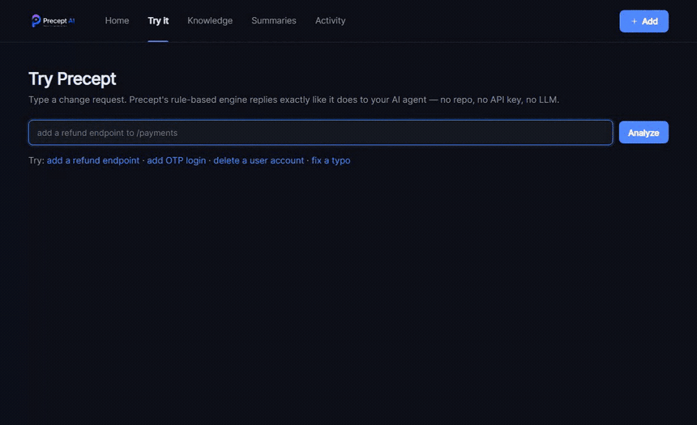
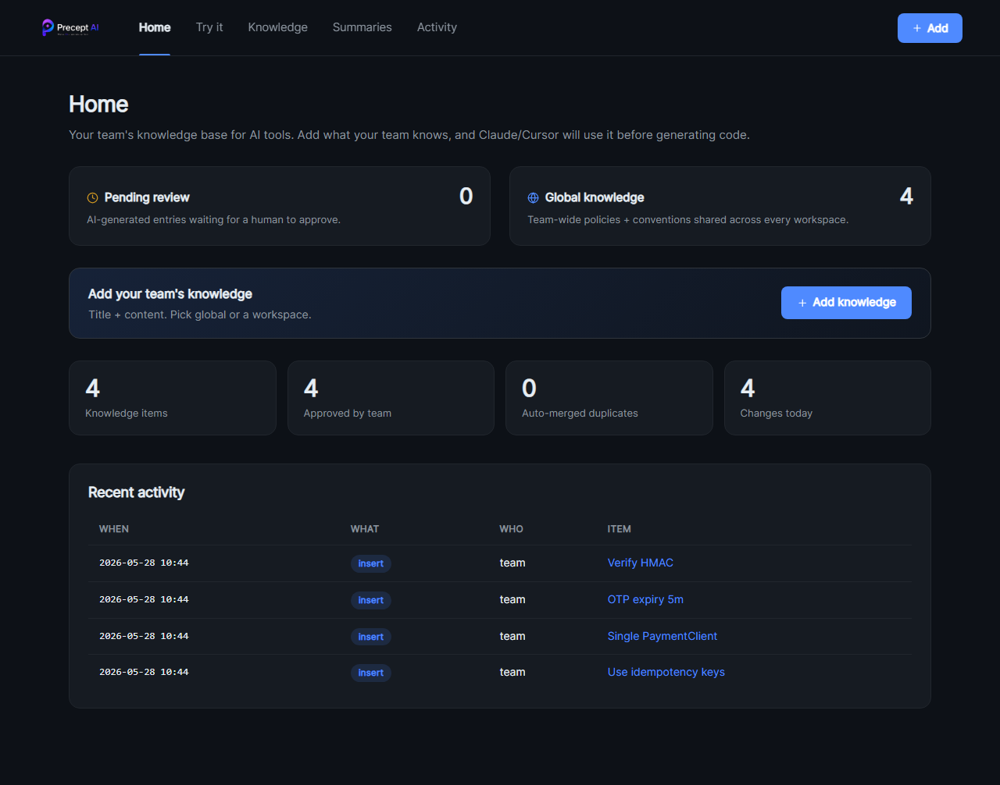

# Precept AI


**The guardrail that stops your AI agent from breaking your codebase.**

AI agents write code faster than ever — and break prod faster than ever. Precept is the checkpoint they hit _before_ writing a line: it tells them what your team already decided, what they're about to break, and when to stop.

<p align="center">
  
</p>

[](LICENSE)
[](https://www.python.org/downloads/)

---

## The problem

Coding agents (Claude Code, Cursor, Copilot, Hermes…) are getting more autonomous every month. That's great — until one confidently invents a third payment client, ignores the idempotency rule your team agreed on six months ago, and ships it.

More autonomy means more speed _and_ more blast radius. Precept is the seatbelt.

## What it does

Precept sits between your AI agent and your repo over MCP. Before the agent writes code, it must ask Precept — and gets back this:

```text
Request:   "add a refund endpoint to /payments"
Domain:    payment (HIGH)
Decision:  ASK — human confirmation required
Reuse:     PaymentClient, IdempotencyMiddleware  (don't recreate)
Team rule: "Use idempotency keys" (alice, approved)
Risk:      refund → webhook → ledger
```

**Before Precept:** the agent invents a new payment client, skips the idempotency rule, ships it. You catch it in review — or in prod.

**After Precept:** the agent reuses `PaymentClient`, follows the team rule, and pauses on the HIGH-risk change until a human approves. AI-written knowledge lands as **Pending** until a human approves it on the dashboard.

<p align="center">
  
</p>

---

## Why Precept, not just another AI tool

Most AI dev tools make your agent **write more** or **know more**. Precept is the only layer that makes it **stop and check before it acts** — and it rides on top of whatever agent you already use, over MCP.

| Category               | Examples                              | What they do                          | What Precept adds                                                                |
| ---------------------- | ------------------------------------- | ------------------------------------- | ------------------------------------------------------------------------------- |
| Autonomous coding agents | Claude Code, Cursor, Copilot, Hermes | Write & edit code fast                | A pre-write checkpoint — reuse, blast radius, team rules, a binding proceed/ask/reject |
| RAG / wikis / Obsidian | Notion, Obsidian, vector KBs          | Store knowledge you must remember to read | **Enforced** consultation: the agent _must_ query before coding              |
| Codebase indexers      | CodeGraph, Sourcegraph, Repowise      | Feed the agent more context           | A _decision_, not just context: risk level + cascade + a human-approval gate    |
| Decision records       | git-trailer / commit-log tools        | Record "why" after the fact           | Enforce those decisions _before_ the next change                                 |

> Precept doesn't compete with your agent — it's the **seatbelt your agent wears**. More agent autonomy makes Precept _more_ valuable, not less.

**Positioning:** the governance + guardrail layer for teams letting AI agents touch real codebases — it decides what the agent may reuse, what it might break, and when a human must sign off.

### vs RAG / knowledge graphs, in detail

| Dimension       | RAG / Vector KB          | Generic Knowledge Graph | **Precept**                                                         |
| --------------- | ------------------------ | ----------------------- | ------------------------------------------------------------------- |
| Knowledge shape | text chunks + embeddings | static nodes/edges      | **Cognitive Graph** — domain × asset × convention × impact edge     |
| When AI uses it | pulled at prompt time    | queried only when asked | **Mandatory call before any code change** (`analyze_intent`)        |
| Who decides     | LLM decides              | LLM interprets          | **Rule-based engine** returns `proceed` / `warn` / `ask` / `reject` |
| Team knowledge  | none / mixed in          | write your own schema   | `remember_team_decision` + approval queue                           |
| Impact / risk   | none                     | manual queries          | **Blast radius + risk level computed automatically**                |
| Enforcement     | passive                  | passive                 | **MCP-first + audit** — AI cannot skip it                           |

> RAG and KGs are **a library**. Precept is **a checkpoint before code is written.**

### Accuracy in practice

Higher on real codebases — AI stops reinventing utilities, matches team style, and won't contradict past decisions. Risky changes are blocked before code is written.

Doesn't help much on greenfield / one-shot scripts with no team context.

### The more you use it, the less it costs

**Cheaper over time** — because the AI gets more accurate the longer you use it:

- Reuses approved team decisions instead of re-deriving them every session
- Stops writing code that gets rejected and rewritten (the biggest token sink)
- Catches risky changes before code is generated, not after
- Pulls only the relevant assets / conventions for each request, not the whole repo

A small upfront investment makes this possible: seed memory once with `/precept-generate`, then let every `/precept` call run the full pipeline so each change starts from real context.

---

## Quickstart

Two commands. The first installs the CLI; the second wires up everything else.

```bash
uv tool install precept-ai          # or: git+https://github.com/qorstack/precept.git
precept quickstart
```

`precept quickstart` scaffolds `.env` + `docker-compose.yml`, starts Postgres + the dashboard, registers the MCP server with Claude Code, and installs the `/precept` slash commands. It's safe to re-run — existing files are left untouched.

Then open Claude Code in any repo and try:

```text
/precept add a refund endpoint to /payments
```

Prefer to wire it up yourself? The manual steps are below.

<details>
<summary><b>Prerequisites</b></summary>

- Docker + Docker Compose v2 (the published image supports `linux/amd64` and `linux/arm64`, so Apple Silicon Macs work natively)
- Python 3.11+ with [`uv`](https://docs.astral.sh/uv/). Install it:
  - macOS / Linux: `curl -LsSf https://astral.sh/uv/install.sh | sh` (or `brew install uv`)
  - Windows: `powershell -ExecutionPolicy ByPass -c "irm https://astral.sh/uv/install.ps1 | iex"`
- ~2GB free RAM

</details>

---

## Manual setup

### Part 1 — Dashboard

#### 1. Create `.env`

```env
POSTGRES_USER=precept
POSTGRES_PASSWORD=precept
POSTGRES_DB=precept
POSTGRES_PORT=5432
WEB_PORT=8080
```

#### 2. Create `docker-compose.yml`

```yaml
services:
  postgres:
    image: pgvector/pgvector:pg16
    container_name: precept-postgres
    environment:
      POSTGRES_USER: ${POSTGRES_USER}
      POSTGRES_PASSWORD: ${POSTGRES_PASSWORD}
      POSTGRES_DB: ${POSTGRES_DB}
    ports: ["${POSTGRES_PORT}:5432"]
    volumes: [precept_pgdata:/var/lib/postgresql/data]
    healthcheck:
      test: ["CMD-SHELL", "pg_isready -U $$POSTGRES_USER"]
      interval: 5s

  web:
    image: ghcr.io/qorstack/precept:latest
    container_name: precept-web
    depends_on: { postgres: { condition: service_healthy } }
    environment:
      POSTGRES_USER: ${POSTGRES_USER}
      POSTGRES_PASSWORD: ${POSTGRES_PASSWORD}
      POSTGRES_DB: ${POSTGRES_DB}
      POSTGRES_HOST: postgres
      POSTGRES_PORT: 5432
    ports: ["${WEB_PORT}:8080"]

volumes:
  precept_pgdata:
```

#### 3. Start & open

```bash
docker compose up -d
open http://localhost:8080
```

Use the dashboard to add knowledge entries by hand. Done — or continue to Part 2 for AI integration.

---

### Part 2 — AI integration

#### 4. Install the CLI

Install [`uv`](https://docs.astral.sh/uv/), then the CLI:

On macOS / Linux:

```bash
curl -LsSf https://astral.sh/uv/install.sh | sh && source $HOME/.local/bin/env
uv tool install git+https://github.com/qorstack/precept.git
precept --version
```

On Windows (PowerShell):

```powershell
powershell -ExecutionPolicy ByPass -c "irm https://astral.sh/uv/install.ps1 | iex"
# close & reopen PowerShell so PATH refreshes, then:
uv tool install git+https://github.com/qorstack/precept.git
precept --version
```

> `uv: command not found` after install? Run `source $HOME/.local/bin/env` (mac/Linux) or reopen the terminal (Windows). To make it permanent on mac/Linux: `echo '. "$HOME/.local/bin/env"' >> ~/.zshrc`.

#### 5. Create `precept.config` at each repo root

```toml
workspace = "my-product"
repo_name = "aaa-api"

[database]
host     = "localhost"
port     = 5432
user     = "precept"
password = "precept"
db       = "precept"
schema   = "public"
```

> Or put `[database]` in `~/.precept.config` once and per-repo files only need `workspace` + `repo_name`.

When Claude saves memory via MCP, precept auto-tags it with `scope=workspace`, this `workspace`, and this `repo_name` — entries land in the right bucket on the dashboard without any extra work.

#### 6. Register precept with Claude Code

Need Claude Code first? Install it from [claude.com/claude-code](https://claude.com/claude-code) (`npm install -g @anthropic-ai/claude-code`). Then:

```bash
claude mcp add --scope user precept -- precept mcp
claude mcp list   # should show: precept ✓
```

#### 7. Install the slash commands

```bash
precept install-claude-commands     # copies /precept and /precept-generate to ~/.claude/commands/
```

Two commands ship:

| Command              | Use it when                                                                                                                                                                                                                   |
| -------------------- | ----------------------------------------------------------------------------------------------------------------------------------------------------------------------------------------------------------------------------- |
| `/precept <request>` | **Every feature / refactor / fix.** Forces Claude to run the full pipeline (analyze_intent → recall_context → get_reusable_assets → assess_risk_in_context) and open with a `Risk:` / `Decision:` header before writing code. |
| `/precept-generate`  | **Once, then occasionally.** Have Claude read this repo and seed meaningful memory entries. Safe to re-run after refactors.                                                                                                   |

> Why a slash command? MCP tool descriptions only reach Claude when it _decides_ to use a tool — a plain prompt can slip past the pipeline. `/precept` makes the consult mandatory.

#### 8. Seed memory from the repo (first time or re-generate)

Open Claude inside the repo and run:

```text
/precept-generate
```

Claude will walk the codebase, extract meaningful conventions / decisions / reusable assets, and save them through MCP. Entries land as **Pending** for you to approve on the dashboard.

Re-run after a big refactor or when onboarding a new repo — it's idempotent.

> Add `.precept/` to your repo's `.gitignore`

#### 9. Use it

In Claude, try:

```text
/precept add a refund endpoint to /payments
```

You should see a reply that opens with `Risk: <level> — <why>` / `Decision: ...` and references your stored memory in the `Memory:` line.

If not: `claude mcp list` shows `✗` → run `precept mcp` in a terminal to see the error (usually missing DB credentials).

---

## Dashboard at a glance

- **Home** — two hero cards: ⏳ **Pending review** (AI entries awaiting approval) + 🌐 **Global knowledge**. Plus a per-workspace breakdown.
- **Knowledge** — workspace pills at the top, then filter by source (Human / AI), status (Approved / Pending), or domain. Every row shows scope + source badges.
- **Entry detail** — full metadata strip plus a **Move to Global ↑** / **Move to Workspace ↓** button so you can re-scope without re-creating.
- **Summaries / Activity** — per-domain AI syntheses and full audit log.

---

## Tips — fewer tokens, sharper answers

- **Use `/precept` only for real changes** — features, refactors, bug fixes. Skip it for renames, typos, formatting.
- **Approve memory on the dashboard** — pending entries are not recalled in the next session. Approved ones are.
- **Run `/precept-generate` once per repo** — re-run only after a big refactor or new domain. It's not a routine task.
- **Set `repo_name` precisely** in `precept.config` — scopes recall tighter, so Claude pulls less but more relevant context.
- **Forget stale memory** — outdated decisions waste tokens and confuse Claude. Use `precept memory forget <id>` or the dashboard.

---

## Updating

```bash
# Upgrade the CLI + MCP server
uv tool upgrade precept

# Then restart Claude Code so it reloads the MCP subprocess
# (the old version is cached until restart)

# Upgrade the dashboard
docker compose pull web && docker compose up -d
```

Stop / wipe:

```bash
docker compose stop                # keep data
docker compose down -v             # wipe all data
```

---

MIT — see [LICENSE](LICENSE).
